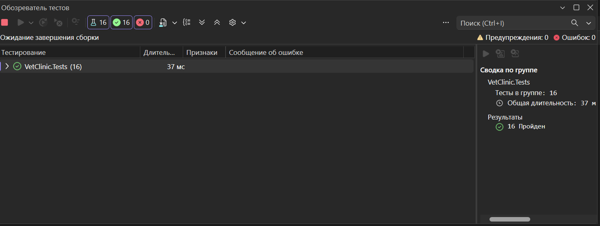

# Лабораторная 1 - Ветеринарная клиника

Ладыгин Денис Дмитриевич, группа 6411, вариант 10.

Реализована доменная модель ветклиники и unit тесты на LINQ-запросы из задания. Данные хранятся в памяти.

## Структура

- `VetClinic.Domain` - доменные классы
- `VetClinic.Tests` - тестовые данные и unit тесты (xunit v3)

## Модель данных

- `Owner` - владелец: ФИО, адрес, телефон, список питомцев
- `Pet` - питомец: кличка, вид, порода, дата рождения, вес, владелец
- `Breed` - справочник пород с привязкой к виду животного
- `AnimalSpecies` - перечисление видов животных
- `Vet` - врач: паспорт, ФИО, год рождения, специализация, стаж
- `Specialization` - справочник специализаций, у общих специализаций вид не указан
- `Appointment` - запись на прием: дата и время, кабинет, питомец, врач, признак повторного приема

## Запросы

1. Все ветеринары, специализирующиеся на выбранном виде животных
2. Все питомцы, записанные на прием к указанному врачу, по кличке
3. Количество повторных приемов выбранной породы
4. Владельцы, у которых больше одного питомца, по ФИО
5. Приемы за месяц в выбранном кабинете

## Запуск тестов

```sh
cd VetClinic
dotnet test --solution VetClinic.slnx
```

### Результаты тестов


